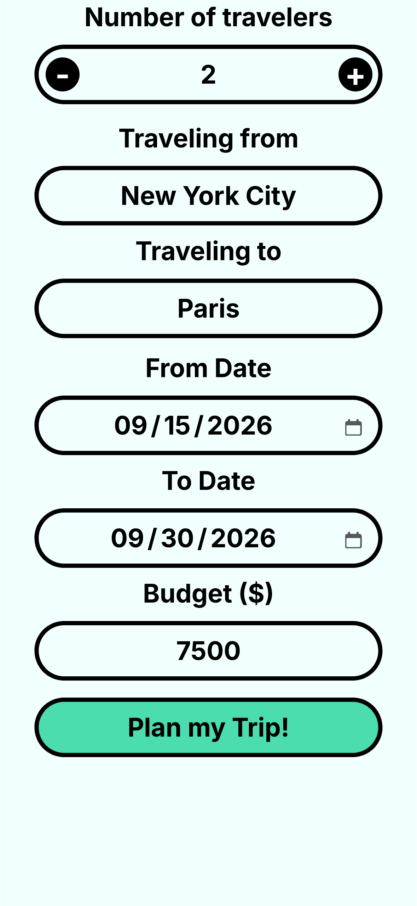
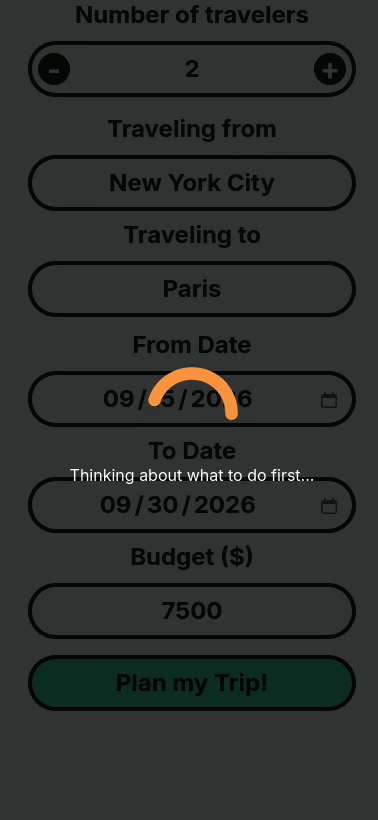
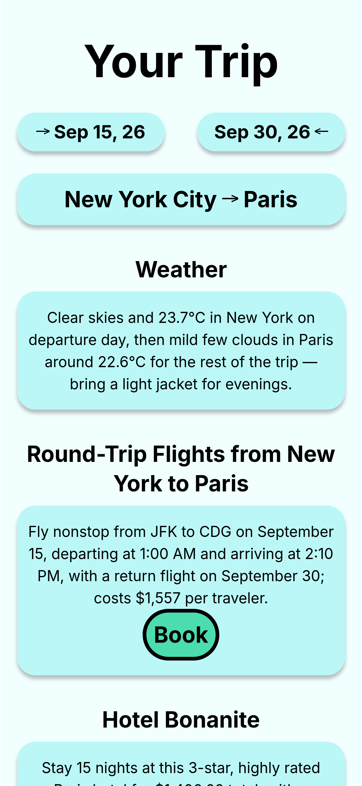
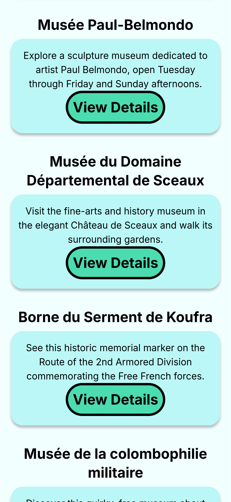

# Travel Agent

This is a travel planner app powered by AI agents, built with Next.js. The agents are implemented with OpenAI's Agents SDK, and can check the weather, find available accommodation, search for attractions, and more. While the agents work, the app streams their progress to the user. The design and functionalities are based on [Scrimba.com](https://scrimba.com)'s travel agent project.

## Demo

The app uses a mobile app design. It features a form for the user to submit their trip details.



Submitting the form renders a loading screen with dynamic status text. The text changes based on the agent's current action.



After the agent finishes planning the trip, the result is shown to the user.




Currently, clicking the "Book" or "View Details" buttons will redirect the user to booking.com and Wikipedia respectively.

## Technical Details

### Framework

The app uses Next.js 16 with the App Router, which allowed the backend to be built alongside the frontend in a single project and keeps sensitive API keys off the frontend.

### Frontend

The form is implemented using native HTML elements and React 19's `useActionState` hook. This simplified loading state management and enforced a uniform handling of the form state.

### Backend

#### Route

The app features a single API endpoint that runs two agents when called with valid form data. The data is validated with Zod.

#### Agents

The agents are implemented with OpenAI's Agents SDK. Two agents are run on each API call:

- **Planner Agent** — takes the information from the submitted form and plans the user's trip accordingly. It has access to the following [tools](/app/utils/tools.ts): `getLatLon`, `getWeather`, `searchAirport`, `getFlights`, `getHotels`, and `getAttractions`. The agent is instructed to use tools when appropriate and plan the trip based on their output. It returns its result in plain text.
- **Formatter Agent** — takes that plain text and organizes it into JSON objects matching the shape required by the frontend. The formatter is given a few-shot example of a successful run, further solidifying the desired shape of the output.

The two-agent approach was chosen because models such as DeepSeek V4.0 Flash and GLM 5.3 Flash had difficulty using tools and producing structured output simultaneously. Splitting the work allows these popular models to behave as expected.

#### Tools

Each tool is a wrapper that makes a request to an API provider, such as RapidAPI, OpenWeather, and Geoapify.

Each tool has its own `errorFunction` that instructs the LLM on how to behave when an API call fails. For example, a 402 on `getLatLon` instructs the model to fall back on its own knowledge of the city's coordinates, whereas a 429 on `getFlights` instructs it to retry once and then fall back to an estimate it must label as such.

The tools also filter what the APIs return, extracting only the important fields from each entry to conserve tokens and context.

#### Agent Context

The `getFlights` tool uses the Google Flights API, whose endpoints return a `booking_token` used to link to a booking for a given flight. The tokens are long strings with high randomness. To prevent the LLM from hallucinating non-existent tokens, they are saved to the agent context programmatically. Each token is assigned a `ref` as identification, and the Planner Agent is instructed to include that `ref` in its output.

The refs are sent to the frontend along with the itinerary, so the booking button has the real token available to it. Redeeming it is not implemented yet — see [Roadmap](#roadmap).

### Wiring

The frontend and backend communicate over an SSE stream. The connection is kept alive after the form is submitted, and the server sends the frontend information about the agent's current step after each tool call and tool completion. The frontend renders the corresponding messages to the user to reduce the perceived delay. Zod forms the contract between the frontend and the backend; all communication between the two is validated.

### Testing

The app is tested with Vitest, React Testing Library, and MSW — 138 tests covering about 97% of statements. OpenAI's `ScriptedModel` is used to mock LLM output, and the tools are tested against stored data from real API responses.

Every push and pull request to `main` runs the suite and ESLint in CI.

## Try it

First, clone the repository and install the dependencies:

```bash
git clone https://github.com/1214443427/travel-agent.git
cd travel-agent
npm ci
```

Create an `.env` file following the examples in `.env.example`. You will need credentials for four services, each of which has a free tier:

| Variable                                          | Service                                                                                          |
| ------------------------------------------------- | ------------------------------------------------------------------------------------------------ |
| `AI_URL`, `AI_KEY`, `AI_MODEL`, `FORMATTER_MODEL` | Any OpenAI chat completions compatible endpoint ([OpenRouter](https://openrouter.ai) by default) |
| `WEATHER_API`                                     | [OpenWeather](https://openweathermap.org/api), for geocoding and weather                         |
| `RAPID_API_KEY`                                   | [RapidAPI](https://rapidapi.com), subscribed to both `google-flights2` and `booking-com15`       |
| `GEOAPIFY_KEY`                                    | [Geoapify](https://www.geoapify.com), for attractions                                            |

The app throws on startup if any of them are missing.

Then start the server:

```bash
npm run dev
```

Open [http://localhost:3000](http://localhost:3000) with your browser to see the app.

## Roadmap

- **Real booking.** The "Book" button currently opens booking.com rather than completing a reservation. The token plumbing described above is already in place; what remains is redeeming it against the provider.
- **Forecast weather.** `getWeather` reads current conditions, so for a trip planned months out it indicates typical conditions rather than an actual forecast for those dates.

## License

MIT
