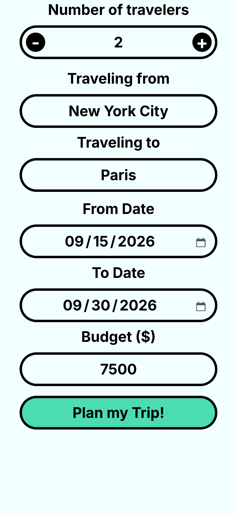
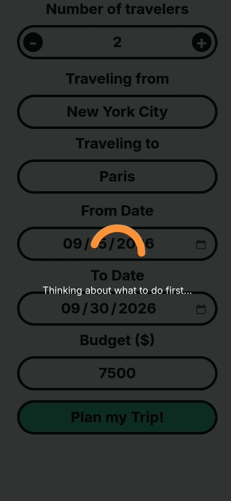
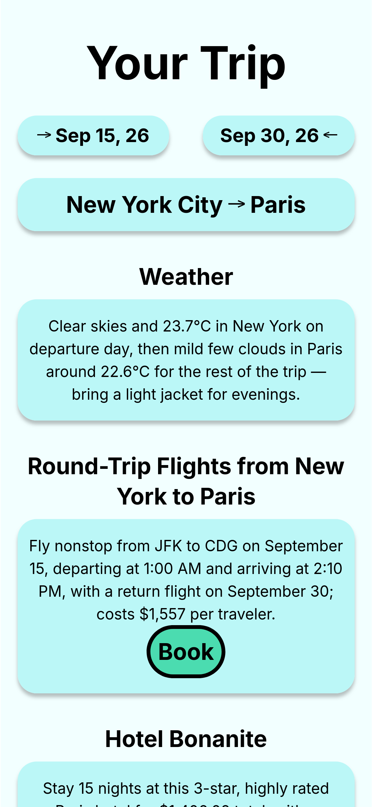
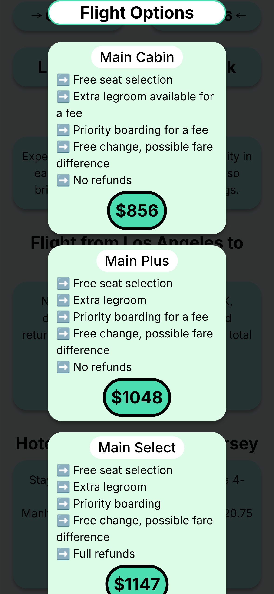
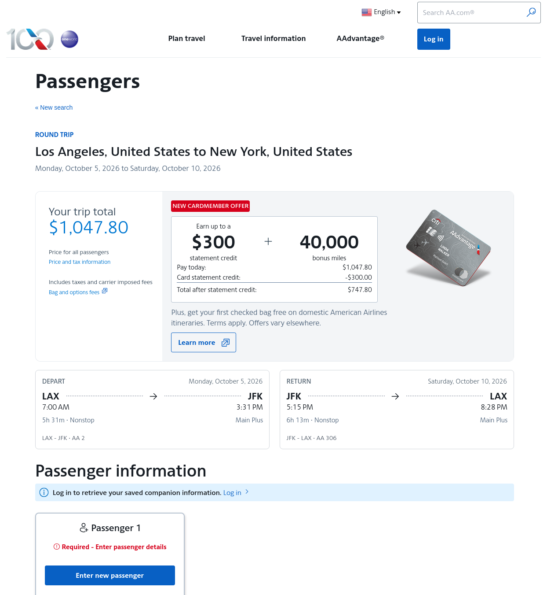
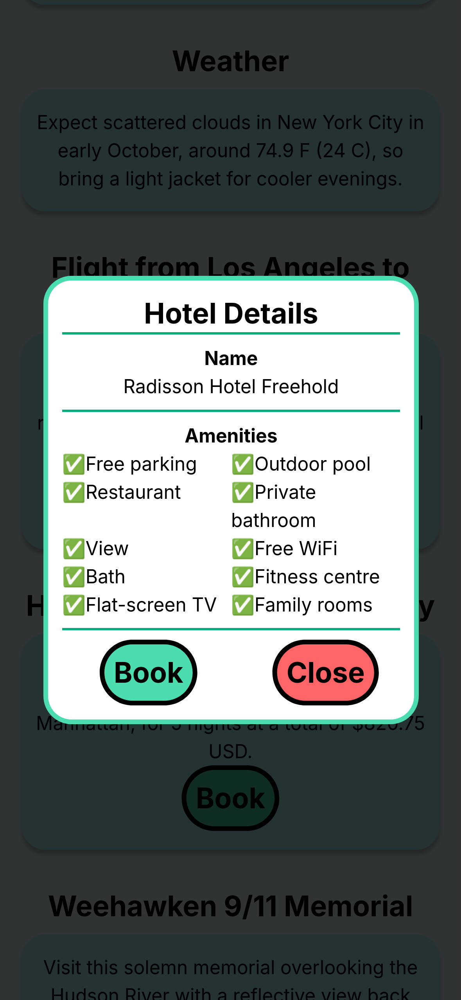
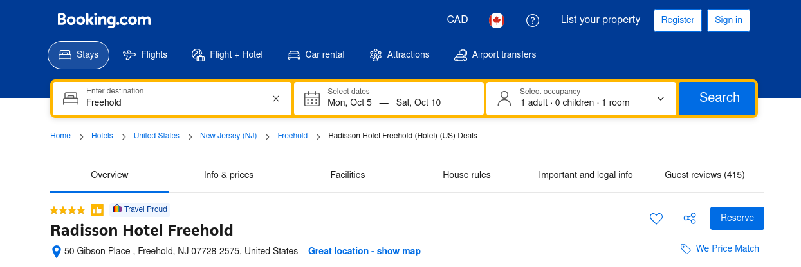

# Travel Agent

This is a travel planner app powered by AI agents, built with Next.js. The agents are implemented with OpenAI's Agents SDK and can check the weather, find available accommodation, search for attractions, and more. While the agents work, the app streams their progress to the user. The design and features are based on [Scrimba.com](https://scrimba.com)'s travel agent project.

## Demo

The app has a mobile-first design. It starts with a form where the user enters their trip details.



Submitting the form shows a loading screen with dynamic status text, which changes based on the agent's current action.



When the agent finishes planning the trip, the result is shown to the user.




Clicking the "Book" button on the flight or hotel opens a modal with more details. This data comes from the same API providers the agent's tools use.

The flight details modal lists the available booking options, prioritizing those sold directly by airlines. When the user picks an option, the app asks for confirmation and then redirects them to the airline's booking page with the exact same offer.





The hotel details modal lists the hotel's amenities and has a "Book" button. Clicking it opens the hotel's Booking.com listing, with the check-in date, check-out date, and number of guests pre-filled from the agent's hotel search.




For attractions, a "View Details" button appears only when the attraction has a Wikipedia page, and clicking it opens that page.

## Technical Details

### Framework

The app uses Next.js 16 with the App Router, which lets the backend be built alongside the frontend in a single project and keeps sensitive API keys off the frontend.

### Frontend

The form is built with native HTML elements and React 19's `useActionState` hook. This simplifies loading-state management and keeps form-state handling uniform.

### Backend

#### Routes

The app has four API endpoints. Every request body is validated with Zod.

- `/api/trip`: runs the two agents and streams their progress, ending with the finished trip plan. This is the app's core feature.
- `/api/flight`: fetches the booking options for the planned flight, such as cabin class, exact price, and included amenities.
- `/api/book`: fetches the booking URL for the chosen flight option. It usually points to an airline's website.
- `/api/hotel`: the hotel counterpart of `/api/flight`. It fetches details about the planned hotel stay, including the exact price, amenities, and a link to the hotel's Booking.com listing.

#### Agents

The agents are implemented with OpenAI's Agents SDK. Each call to `/api/trip` runs two agents:

- **Planner Agent** — takes the submitted form data and plans the trip. It has access to the following [tools](/app/utils/tools.ts): `getLatLon`, `getWeather`, `searchAirport`, `getFlights`, `getNextFlight`, `getHotels`, and `getAttractions`. The agent is instructed to use the tools when appropriate and to base its plan on their output. It returns its result as plain text.
- **Formatter Agent** — converts that plain text into JSON matching the shape the frontend expects. The formatter is given a few-shot example of a successful run to reinforce the expected output shape.

The two-agent approach was chosen because models such as DeepSeek V4.0 Flash and GLM 5.3 Flash struggled to use tools and produce structured output at the same time. Splitting the work lets these popular models behave as expected.

#### Tools

Each tool wraps a request to an API provider, such as RapidAPI, OpenWeather, or Geoapify.

Each tool has its own `errorFunction` that tells the LLM how to proceed when an API call fails. For example, a 402 from `getLatLon` tells the model to fall back on its own knowledge of the city's coordinates, while a 429 from `getFlights` tells it to retry once and then fall back to an estimate, which it must label as such.

The tools also filter what the APIs return, keeping only the important fields from each entry to save tokens and context. For example, `getHotels` returns at most five hotels, with the most important information such prices, star level, and ratings.

#### Agent Context

Getting the booking URL for a flight or hotel requires tokens from the API providers. These are long, random strings, so the LLM never handles them directly; otherwise it could hallucinate tokens that don't exist. Instead, each tool saves its tokens to the agent context and gives each one a short `ref` (such as `flt_3` or `htl_4`), which the planner includes in its output:

1. `getFlights` searches Google Flights for outbound flights. Each result carries a `next_token`, which is used to look up the matching return flights.
2. `getNextFlight` uses that token to find the return flights. Each result carries a `booking_token`, which identifies the full round trip.
3. `getHotels` saves each hotel's `hotel_id`, together with the dates and number of guests it searched for.

The `refs` are sent to the frontend along with the itinerary. When the user clicks "Book", the frontend looks up the token behind that ref and sends it to `/api/flight` or `/api/hotel`, which redeems it with Google Flights or Booking.com.

### Wiring

The frontend and backend communicate over a server-sent events (SSE) stream. The connection stays open after the form is submitted, and the server notifies the frontend each time a tool starts or finishes. The frontend shows a matching status message, which makes the app feel more responsive.

Zod forms the contract between the frontend and the backend, and all communication between the two is validated. For the booking endpoints, each request and response schema is defined once in [`contract.ts`](/app/utils/contract.ts) and shared by the route handler on the server and the fetch helper on the client.

### Testing

The app is tested with Vitest, React Testing Library, and MSW. OpenAI's `ScriptedModel` is used to mock LLM output, and the tools are tested against stored data from real API responses.

Every push and pull request to `main` runs the test suite and ESLint in CI.

## Try it

First, clone the repository and install the dependencies:

```bash
git clone https://github.com/1214443427/travel-agent.git
cd travel-agent
npm ci
```

Create a `.env` file following the examples in `.env.example`. You will need credentials for four services:

| Variable                                          | Service                                                                                          |
| ------------------------------------------------- | ------------------------------------------------------------------------------------------------ |
| `AI_URL`, `AI_KEY`, `AI_MODEL`, `FORMATTER_MODEL` | Any OpenAI chat completions compatible endpoint ([OpenRouter](https://openrouter.ai) by default) |
| `WEATHER_API`                                     | [OpenWeather](https://openweathermap.org/api), for geocoding and weather                         |
| `RAPID_API_KEY`                                   | [RapidAPI](https://rapidapi.com), subscribed to both `google-flights2` and `booking-com15`       |
| `GEOAPIFY_KEY`                                    | [Geoapify](https://www.geoapify.com), for attractions                                            |

The API routes throw an error if any of these variables is missing.

Then start the server:

```bash
npm run dev
```

Open [http://localhost:3000](http://localhost:3000) in your browser to see the app.

To run the tests and the linter:

```bash
npm test
npm run test:coverage
npm run lint
```

## Roadmap

- **Forecast weather.** `getWeather` reads current conditions, so for a trip planned months out, it reflects typical conditions rather than an actual forecast for those dates.

## License

MIT
